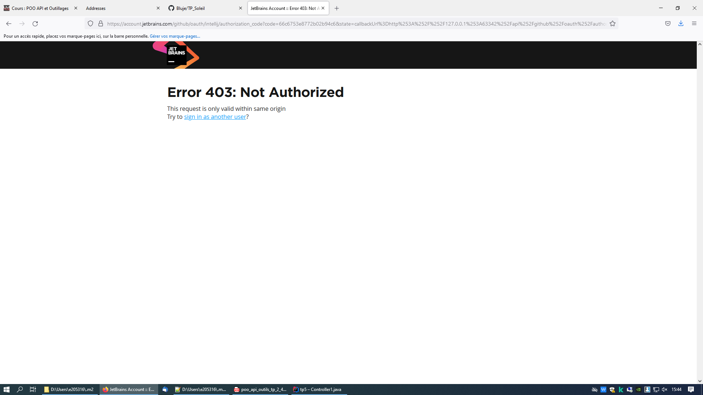

#Etape 5 

###Web : 
Fournit l'infrastructure nécessaire à la création et à l'exécution d'applications web (c'est un sous-projet de Spring Framework)
###JPA : 
permet de simplifier l'interaction avec différents systèmes de stockage de donnés (que ce soit une BDD relationnelle ou bien un APIWeb par exemple)

###Hibernate : 
facilite le développement de la couche persistante d'une application. Il permet la représentation d'objets Java en base de données et inversement. Avec Hibernate, il est plus facile de rechercher des données dans une base car il créé lui-même des objets et les traitements qui remplissent ces objets (ce qui épargne une grande quantité de code)

###H2 : 
base de données SQL que l'on peut créer en JAVA

###DevTools : 
module qui cherche à améliorer le temps de développement d'une application en parallèle de l'utilisation de l'application Spring Boot.

###Thymeleaf : 
template qui peut traiter des fichiers XML, XHTML, HTML5, aussi bien dans des environnements web que non web.

#Etape 13

1) paramétrage de l'url d'appel / greeting avec les getMappoing

2) Choix du fichier HTML à afficher (sur le fichier greeting.html)

3) Envoie du nom auquel on dit bonjour avec @requestParam

#Etape 17

Désormais, la classe address apparait sous forme de table dans la base de donnée.

#Etape 18

La nouvelle table est apparue car en rajoutant les getters et les setters, on peut avoir un constructeur par défaut et accéder aux données présentes dans la class Address

#Etape 20
Après avoir fait la requête de type SELECT sur la table ADDRESS, on a bien accès à tout le contenu de data.sql

#Etape 23
L'annotation @Autowired du code précédent sert à récupérer automatiquement un bean Spring sans que l'on ait à aller le chercher manuellement.
Cette balise fait donc une sorte d'analyse automatique.

#Etape 27
Bien sûr

#Etape 30
Pour ajouter un Bootstrap au projet, il faut télécharger les fichiers en les mettant dans le bon dossier.
On va dans File, puis Seetings, puis Plugins et à partir d'ici, on télécharge le Bootstrap 3.
Ensuite on relance l'IDE pour pouvoir appliquer ces changements.

On télécharge les fichiers bootstrap à part du site "https://getbootstrap.com/docs/3.3/getting-started/", puis on mets ces fichiers dans le dossier static des ressources

////////////////////////////////////////////////////////////////////

TP4
#Etape 6
###— Faut-il une clé API pour appeler MeteoConcept ?
Oui, car il y a besoin d'un "token" pour pouvoir accéder à la base de données où sont stockées les informations de météo
###— Quelle URL appeler ?
Il faut appeler l'URL de l'API meteo-concept en précisant les données de localisation de l'endroit que l'on souhaite
###— Quelle m´ethode HTTP utiliser ?
On utilise la méthode http "get" pour pouvoir y préciser les données (de localisation) souhaitées
###— Comment passer les paramètres d’appels ?
Pour passer les paramètres d'appel, on concatène les différents éléments.
###— Où est l’information dont j’ai besoin dans la r´eponse :
    ####— Pour afficher la temp´erature du lieu vis´e par les coordonn´ees GPS
        Cela se trouve au niveau de "weather".
    ####— Pour afficher la préevision de météo du lieu vis´e par les coordonn´ees GPS
        Cela se trouve au niveau du tableau qui contient les différentes prévisions possibles.